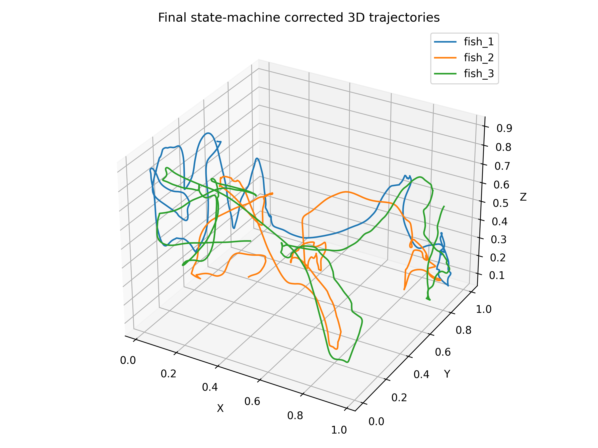
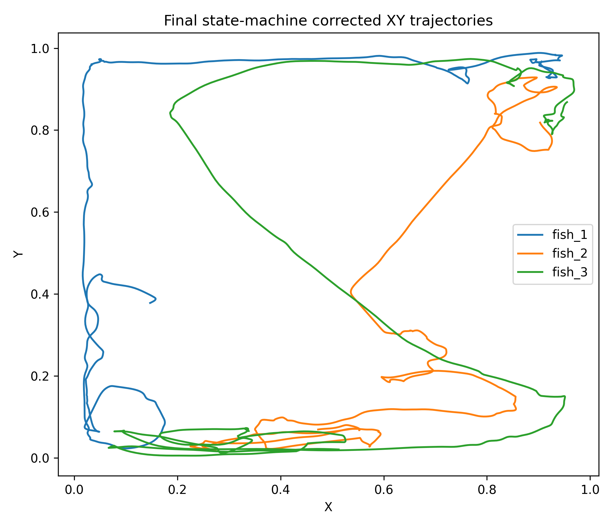
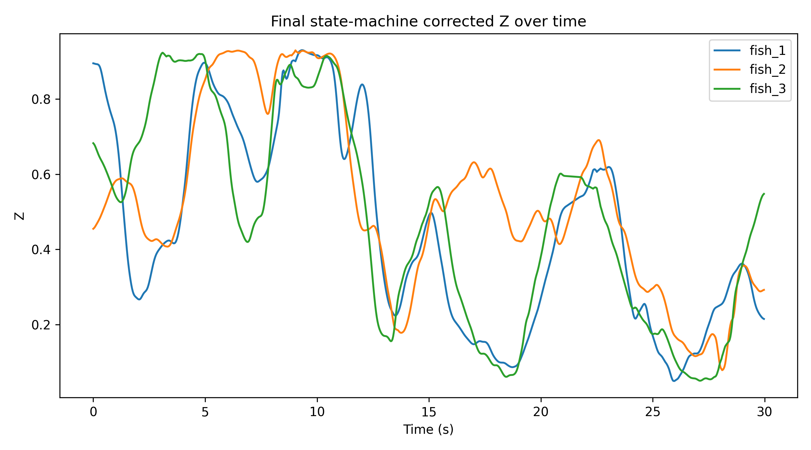
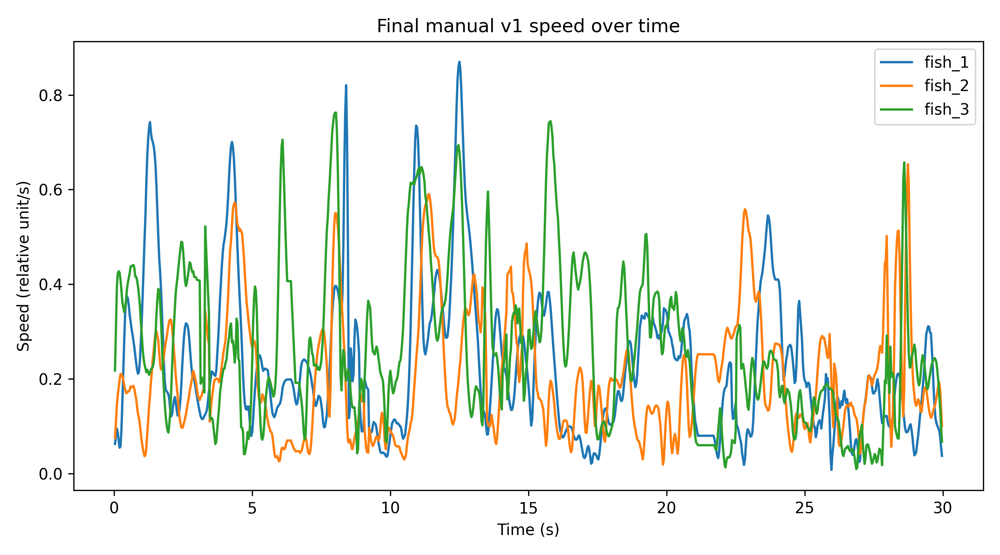
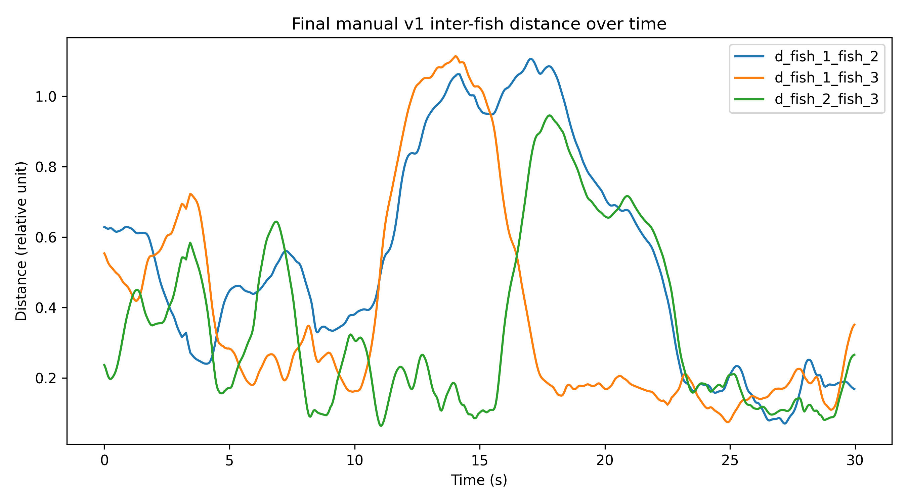

# 基于 YOLO26s 与 ByteTrack 的眼斑双锯鱼跟踪项目

基于 YOLO26s 的 `fish/reflection` 双类别检测、多目标跟踪与双视角三维轨迹重建流程，用于眼斑双锯鱼行为分析。

[English](README.md) | 简体中文

## 项目概览

本项目面向鱼缸视频中的眼斑双锯鱼行为分析。早期 TOP 顶视角检测任务被设置为 `fish` 与 `reflection` 双类别问题：

- `fish`：真实鱼体；
- `reflection`：鱼缸壁上的完整鱼形镜像。

后续跟踪与轨迹分析仅使用 `fish` 类，从而降低鱼缸壁反射对轨迹提取和行为分析的影响。

目前项目已经从二维检测与跟踪验证推进到双视角三维轨迹重建 MVP。当前已完成一个代表性 30 s / 30 Hz 片段的三维轨迹重建、人工复核、身份修正与 pilot 行为指标提取。

## 当前状态

| 模块 | 当前状态 |
|---|---|
| TOP 二维检测与跟踪 | V6 + ByteTrack E2 已完成 5 min TOP 视频评估 |
| TOP 双视角场景适配 | `TOP_yolo26s_v7_scene_adapt` 已完成 |
| LEFT 双视角场景适配 | `LEFT_yolo26s_v1_scene_adapt` 已完成 |
| 双视角同步 | LEFT sample = TOP sample + 460 |
| 三维重建 | 30 s / 30 Hz MVP 已完成 |
| 人工身份复核 | `final_manual_v1` 已完成 |
| 行为指标 | 已提取速度、个体间距离、最近邻距离、群体离散度、Z 轴位置和三维空间利用指标 |

当前瓶颈不再只是检测 mAP，而是高相似个体在交叉、重叠和遮挡后的身份连续性维护。当前路线不再完全依赖 ByteTrack 原始 ID，而是结合检测、双视角几何约束、轨迹 QC、人工回投影复核与后处理进行修正。

## 项目流程

```text
视频输入
→ 视频预处理
→ fish/reflection 双类别检测
→ fish-only 跟踪 / 点位提取
→ TOP/LEFT 同步
→ DLT 标定
→ 三维三角测量
→ 身份复核与修正
→ 插值和平滑
→ 行为指标提取
→ 后续 GCN 群体行为建模
```

## 项目亮点

- 使用 YOLO26s 构建 `fish` / `reflection` 双类别检测模型；
- 通过 CVAT 完成多轮人工标注修正；
- 使用 ByteTrack 对真实鱼体进行 fish-only 跟踪；
- 针对双视角视频分别训练 TOP 与 LEFT 场景适配模型；
- 使用鱼缸结构点进行 DLT 三维标定；
- 通过 offset 扫描完成 TOP/LEFT 时间同步；
- 生成 fish_1 / fish_2 / fish_3 回投影视频并进行人工复核；
- 从最终三维轨迹中提取 pilot 行为指标；
- 后续方向为自动 QC、不确定片段标记、轨迹修正和 GCN 群体行为建模。

## 2026-06-04 更新：双视角三维轨迹 MVP

本项目已完成一个代表性片段的 30 s / 30 Hz 双视角三维轨迹重建 MVP。

### 片段信息

| 项目 | 数值 |
|---|---:|
| 片段 | 9:00-9:30 |
| 帧率 | 30 Hz |
| 帧数 | 900 |
| 鱼数 | 3 |
| 总轨迹点 | 2700 |
| 最终版本 | `final_manual_v1` |

### 标定与同步

DLT 标定使用 8 个鱼缸结构点。

| 视角 | 平均重投影误差 |
|---|---:|
| TOP | 3.12 px |
| LEFT | 5.12 px |

通过 offset 扫描完成 TOP/LEFT 时间同步：

```text
LEFT_sample = TOP_sample + 460
Offset = 15.333 s at 30 Hz
```

offset 校正后三维重建误差：

| 指标 | 数值 |
|---|---:|
| 平均重投影误差 | 4.64 px |
| 中位数重投影误差 | 2.83 px |

### 人工身份修正

通过将三维轨迹重新投影回 TOP 和 LEFT 原视频画面，生成 fish_1 / fish_2 / fish_3 回投影复核视频。

人工复核发现 global sample 186-193 附近存在一次主要身份交换过程，并在其后形成持续标签错位。最终采用状态机规则修正：

- R1：global sample 186-193。身份切换过程不稳定，三条鱼均设为无效点；
- R2：global sample 194-899。当前 fish_2 重映射为最终 fish_1；当前 fish_3 重映射为最终 fish_2；当前 fish_1 重映射为最终 fish_3；
- R3：global sample 195-202。当前 fish_1 和当前 fish_3 存在局部 TOP 定位错误，设为无效点；保留 194 和 203 作为插值锚点。

修正后进行插值和平滑，生成最终版本 `final_manual_v1`。

### 最终 QC

| 指标 | 数值 |
|---|---:|
| QC 状态 | pass |
| 时长 | 30.0 s |
| 帧数 | 900 |
| 插值点数 | 40 / 2700 |
| 插值比例 | 1.48% |
| X 范围 | 0.0166-0.9691 |
| Y 范围 | 0.0054-0.9884 |
| Z 范围 | 0.0496-0.9302 |

### Pilot 行为指标

| 指标 | 数值 |
|---|---:|
| 群体平均速度 | 0.2348 |
| 平均个体间距离 | 0.4222 |
| 平均最近邻距离 | 0.2906 |
| 平均群体离散度 | 0.2507 |
| 群体中心平均 Z 位置 | 0.4887 |
| 三维包围盒空间利用体积 | 0.8245 |

这些指标说明，经过人工复核后的三维轨迹已经可以转化为行为分析特征，可作为后续图结构群体行为建模的 pilot 输入。

## 结果预览

三维轨迹：



XY 轨迹：



Z 轴随时间变化：



速度随时间变化：



个体间距离随时间变化：



## 本次提交包含的结果文件

本仓库仅提交轻量级结果文件：

```text
docs/progress/2026-06-04_mvp3d_final_manual_v1.md
docs/mvp3d/final_manual_v1_behavior_metrics.md
results/mvp3d_final_manual_v1/figures/
results/mvp3d_final_manual_v1/metrics/
results/mvp3d_final_manual_v1/qc/
```

原始视频、复核视频、模型权重、训练图片和完整中间过程文件暂不公开。

## 检测类别与标注规则

| 类别 ID | 类别名 | 含义 |
|---:|---|---|
| 0 | `fish` | 真实鱼体 |
| 1 | `reflection` | 鱼缸壁上的完整鱼形反射 |

标注规则：

- 真实鱼体标注为 `fish`；
- 鱼缸壁上的完整鱼形镜像标注为 `reflection`；
- 普通光斑、水流纹理、气泡不标注；
- 严重遮挡、轮廓不清或无法判断的鱼不标注；
- 鱼体重叠但能区分个体时，分别标注为多个 `fish`；
- 容易被模型误识别为真实鱼体的完整反射，应标注为 `reflection`。

## 数据集构建概况

TOP 视角数据集由多轮抽帧、YOLO 预标注和 CVAT 人工修正构成。

| 数据集 | 图片数 | 标注框数 |
|---|---:|---:|
| 训练集 | 1128 | 4432 |
| 验证集 | 233 | 939 |
| 合计 | 1361 | 5371 |

主要批次：

| 批次 | 来源 | 用途 | 说明 |
|---|---|---|---|
| 早期基础数据 | `TOP_final.mp4` | train / val | 建立初始 fish/reflection 数据集 |
| `top2m` | `TOP_test_2min.mp4` | train | 约 200 张人工标注图 |
| `top5m300` | `TOP_test_5min.mp4` | train | 300 张模型预标 + CVAT 人工修正样本 |
| `v5tr` | `TOP_final.mp4` 20:00-25:00 | train | V5 新增 200 张训练图 |
| `v5val` | `TOP_final.mp4` 10:00-15:00 | val | V5 新增 100 张验证图 |
| `v6tr` | `TOP_final.mp4` 15:00-20:00 | train | V6 新增 300 张训练图 |
| `v6val` | `TOP_final.mp4` 05:00-10:00 | val | V6 新增 100 张验证图 |

V6 数据修正过程中发现并处理了三个主要问题：

- 预标框普遍略偏大；
- 约 10 张图存在单条鱼重复标记；
- 约 5 张在明显非复杂环境下存在真实鱼漏检。

## 模型迭代记录

| 阶段 | 主要内容 | 结论 |
|---|---|---|
| 早期基线 | 建立初始 fish/reflection 检测模型 | 可初步识别鱼体与反射，但漏检和 ID 碎片较多 |
| V3 | 加入 `TOP_test_2min` 约 200 张人工标注图 | 检测完整性与跟踪稳定性提升 |
| V4 | 加入 `TOP_test_5min` 的 300 张人工修正样本 | 重要中间版本，用于后续预标注 |
| V5 | 新增 `train200 + val100`，并在 V4 基础上微调 | 前一阶段稳定主模型 |
| V6 | 新增 `train300 + val100`，并在 V5 基础上微调 | 改善 fish 定位质量和 tracking 连续性 |
| TOP_v7 | 针对双视角 TOP 视频训练的场景适配模型 | 用于 3D MVP 的 TOP 点位提取 |
| LEFT_v1 | 针对双视角 LEFT 视频训练的 fish-only 场景适配模型 | 用于 3D MVP 的 LEFT 点位提取 |

## 检测模型结果

### V4 与 V5 同一 V5 验证集对比

| 模型 | 验证集 | fish AP | reflection AP | mAP@0.5 |
|---|---|---:|---:|---:|
| V4 | V5 val | 0.862 | 0.940 | 0.901 |
| V5 | V5 val | 0.903 | 0.952 | 0.927 |

### V5 与 V6 同一 current val 对比

| 指标 | V5 | V6 | V6 - V5 |
|---|---:|---:|---:|
| Precision | 0.954238 | 0.939275 | -0.014963 |
| Recall | 0.885493 | 0.887933 | +0.002440 |
| mAP@0.5 | 0.941918 | 0.943662 | +0.001744 |
| mAP@0.5:0.95 | 0.654955 | 0.657031 | +0.002076 |

分类别 mAP@0.5:0.95：

| 类别 | V5 | V6 | V6 - V5 |
|---|---:|---:|---:|
| fish | 0.602350 | 0.622142 | +0.019792 |
| reflection | 0.707560 | 0.691919 | -0.015640 |

### TOP_v7 场景适配结果

| 类别 | Precision | Recall | mAP@0.5 | mAP@0.5:0.95 |
|---|---:|---:|---:|---:|
| all | 0.984 | 0.899 | 0.967 | 0.718 |
| fish | 0.994 | 0.937 | 0.990 | 0.825 |
| reflection | 0.973 | 0.861 | 0.944 | 0.610 |

## V5+E2 与 V6+E2 跟踪对比

测试视频：

```text
TOP_test_5min.mp4
```

跟踪配置：

```text
ByteTrack E2
```

| 指标 | V5+E2 | V6+E2 | 变化 |
|---|---:|---:|---:|
| Mean boxes/frame | 2.8822 | 2.9335 | +0.0513 |
| Median boxes/frame | 3.0 | 3.0 | 0 |
| Total IDs | 32 | 18 | -14 |
| Short IDs < 90 frames | 16 | 4 | -12 |
| Mean ID life | 1622.8 | 2938.2 | +1315.3 |
| Median ID life | 65.0 | 753.5 | +688.5 |
| Manual ID switches | 3 | 4 | +1 |

V6+E2 共处理 18030 帧，帧级 fish 数量统计如下：

| fish 数量条件 | 帧数 |
|---|---:|
| fish 数量 = 3 | 16854 |
| fish 数量 < 3 | 1158 |
| fish 数量 > 3 | 18 |

结论：

- V6+E2 提升了检测完整性和轨迹连续性；
- V6+E2 显著减少了总 ID 数和短寿命 ID；
- 人工复核仍发现 ID 互换；
- 因此，ByteTrack ID 只能作为辅助参考，不应直接等同于最终生物个体身份。

## 当前瓶颈

当前瓶颈是高相似个体在交叉、遮挡和近距离互动后的身份连续性维护。

由于 3 条眼斑双锯鱼外观高度相似，项目不再将外观 ReID 作为主要身份保持路线。当前更合理的方向包括：

- 运动连续性约束；
- 双视角几何约束；
- 回投影复核；
- `identity_uncertain` 片段标记；
- 轨迹后处理；
- 后续自动 QC。

## 当前限制

- `TOP_test_5min` 并非严格独立测试集；
- V6+E2 仍存在人工 ID switch；
- 当前 3D 结果是代表性 30 s MVP 片段，不是完整视频生产级流水线；
- fish_1 / fish_2 / fish_3 为人工复核后的轨迹编号，不是经过外部标记验证的真实生物身份；
- 后续正式暴露实验分析仍需要标准化采集、自动 QC、批处理流程和不确定片段人工复核。

## Roadmap

- [x] 构建 `fish/reflection` 双类别检测数据集
- [x] 完成 V5 / V6 YOLO26s 模型训练与验证
- [x] 完成 V5+E2 与 V6+E2 跟踪性能对比
- [x] 完成 TOP_v7 / LEFT_v1 双视角场景适配模型
- [x] 完成鱼缸结构点 DLT 标定
- [x] 完成 TOP/LEFT 同步 offset 扫描
- [x] 完成 30 s / 30 Hz 双视角三维轨迹 MVP
- [x] 完成 final_manual_v1 身份修正与 QC
- [x] 从最终三维轨迹中提取 pilot 行为指标
- [ ] 建立自动 QC 与不确定片段检测规则
- [ ] 扩展到更长代表性片段
- [ ] 准备 GCN 群体行为建模的图结构输入
- [ ] 设计正式暴露实验视频的标准化批处理流程

## 项目状态

当前项目已经从“二维检测模型优化”推进到完整的阶段性技术链条：

```text
视觉检测
→ 点位提取
→ 双视角三维重建
→ 人工身份修正
→ 行为指标提取
```

当前 `final_manual_v1` 可用于阶段展示、技术路线验证、pilot 行为指标提取和后续 GCN 输入准备。

## 致谢

感谢 [fzz872](https://github.com/fzz872) 在本项目讨论与文档完善方面提供的支持。

## License

本项目采用 MIT License。
